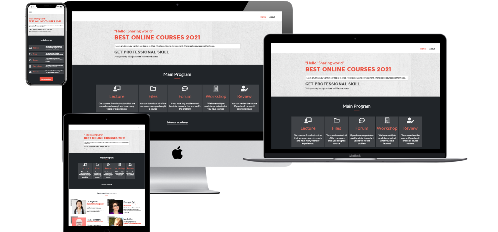

# Module 1 Capstone Project

> This is the first module capstone project in microverse.

## Built With

- HTML
- CSS
- Javascript
- Bootstrap 5

## Live Demo

[Live Demo Link](https://gemmen29.github.io/Module1-Capstone/)

## Loom Video

[Loom video](https://www.loom.com/share/97981bda426b4c4ea21c2e62a1b4113e?sharedAppSource=personal_library)

## Getting Started

To get a local copy up and running follow these simple example steps.
- Click on the top right green "code" button.
- On the dropdown menu, choose "download with zip" button.
- After download, extract the zip file and you have the project running on your machine.

## Authors

👤 **George Magdy**

- GitHub: [@George_Magdy](https://github.com/gemmen29)
- Twitter: [@George_Magdy](https://twitter.com/georgtriple1)
- LinkedIn: [@George_Magdy](https://www.linkedin.com/in/george-magdy-840/)

## 🤝 Contributing

Contributions, issues, and feature requests are welcome!

Feel free to check the [issues page](../../issues/).

## Show your support

Give a ⭐️ if you like this project!

## Acknowledgments

- Inspired by Cindy chen design [Behance](https://www.behance.net/adagio07) 
- The design link [Designlink](https://www.behance.net/gallery/29845175/CC-Global-Summit-2015)

## 📝 License

This project is [MIT](./MIT.md) licensed.
